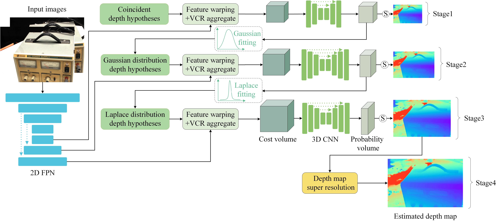

## Multi-distribution fitting for multi-view stereo


### Main contributions: 
1. Fitting Gaussian and Laplace distributions for multiscale depth refinement.


2. View cost aggregation (VCR) build cost volume.


3. To improve the performance, we build a lightweight
image super-resolution network to upsample the depth map.

In addition, if you reduce some performance and run the network directly in H/4xW/4, H/2xW/2, and HxW instead of using an image super-resolution network to improve resolution, you will get better results (3Scale).


## Training

1. Prepare DTU training set(640x512) and BlendedMVS dataset(768x576).
1. Edit config.py and set "DatasetsArgs.root_dir", "LoadDTU.train_root&train_pair", and "LoadBlendedMVS.train_root".
2. Run the script for training.

```
# DTU
python train.py -d dtu 
# BlendedMVS
python train.py -d blendedmvs
```

## Testing

The Pre-training model in "pth". 

1. Prepare DTU test set(1600x1200)([百度网盘](https://pan.baidu.com/s/15hZZ3eY2bSZnae5M079gIQ 
) 提取码：6au3) and Tanks and Temples dataset([百度网盘](https://pan.baidu.com/s/1pAcLFXwi_FGxQUM47JjIMw 
   ) 提取码：a4oz).
2. Edit config.py and set "DatasetsArgs.root_dir", "LoadDTU.eval_root&eval_pair", and "LoadTanks.eval_root"
3. Run the script for the test.

```
# DTU
python eval.py -p pth/dtu_29.pth.pth -d dtu
# Tanks and Temples
python eval.py -p pth/blendedmvs_29.pth -d tanks

```


## Fusion

There three methods in "tools": "filter", "gipuma", and "pcd".

### DTU dataset 

1. Install fusibile tools: tools/fusibile or https://github.com/kysucix/fusibile
2. Edit tools/gipuma/conf.py and set "root_dir", "eval_folder" and "fusibile_exe_path".
3. Run the script.

```
cd tools/gipuma
python fusion.py -cfmgd
```

### Tanks and Temples dataset

1. Run the script.

```
# filter(main method)
cd tools/filter
python dynamic_filter_gpu.py -e EVAL_OUTPUT_LOCATION -r DATASET_PATH -o OUTPUT_PATH 
# pcd
cd tools/pcd
chmod +x ninja_init.sh
source ninja_init.sh
python fusion.py -e EVAL_OUTPUT_LOCATION -r DATASET_PATH -o OUTPUT_PATH 
```

## Results (single Quadro RTX 5000)

### DTU dataset
|                       |  Acc(mm)   |  Comp(mm)  | Overall(mm) | Time(s/view) | Memory(M) |
|:---------------------:|:----------:|:----------:|:-----------:|:------------:|:----------:|
|      MDFNet(4scale)   |    0.349   |    0.303   |    0.326    |    0.376    |   4396     |

### The mean F-score on Tanks and Temples dataset
|                       | intermediate | advanced | 
|:---------------------:|:-----------:|:---------:|
|     MDFNet(4scale)    |    56.18    |    34.70  |  
|     MDFNet(3scale)    |    60.24    |    37.31  |  

example


## Acknowledgements

Our work is partially baed on these opening source work: [MVSNet](https://github.com/YoYo000/MVSNet), [MVSNet-pytorch](https://github.com/xy-guo/MVSNet_pytorch), [D2HC-RMVSNet](https://github.com/yhw-yhw/D2HC-RMVSNet), [pcd-fusion](https://github.com/jzhangbs/pcd-fusion).
We appreciate their contributions to the MVS community.


## Citation

This work will be published in _Machine Vision and Applications_.


<!-- If you find our code or paper helps, please cite:

```
@
```
-->